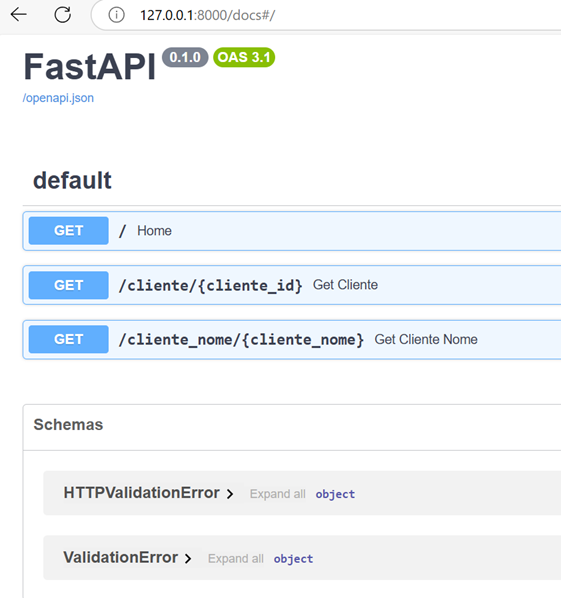
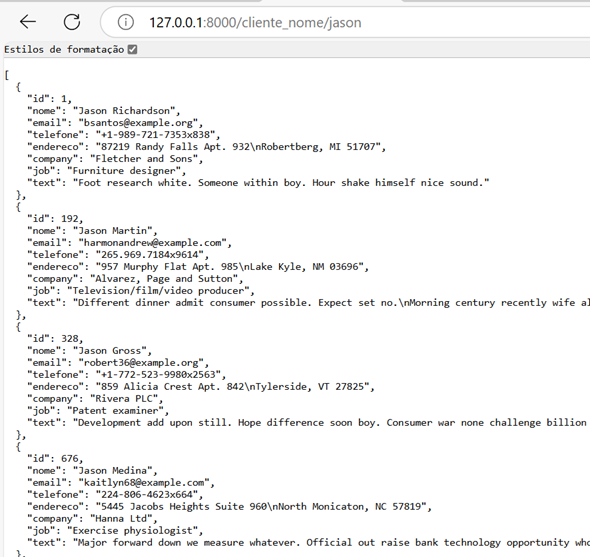

<h1>FastAPI</h1>

<h3>Projeto criado para criar uma API com dados de um BD fictício criado pela biblioteca Faker.</h3>

## 🔧 Funções

- Faker: Gera dados fictícios para exemplos;
- FastAPI: Cria APIs/rotas para consumo de dados.
- FastAPI DOCS: Acessando o link "http://127.0.0.1:8000/docs#/", é exibida a documentação da API.
- 
- 

## 👨‍💻 Tecnologias Utilizadas

Utilizando apenas **PYTHON** e as bibliotecas:
> - Faker
> - FastAPI

## 📜 Conteúdo

> - Baixar o projeto
> - Abra o VSCode e depois selecione File->Open Folder e escolha a pasta criada para o projeto
> - Abra o terminal no menu Terminal->New Terminal
> - Instale o ambiente virtual com o comando no terminal aberto: python -m venv venv
> - Após criar a pasta "venv", execute o comando no terminal aberto: venv/scripts/activate
> - O ambiente virtual será iniciado e ficará no prompt do terminal "(venv) c:\...\Pasta_Criada"
> - Para instalação das bibliotecas do projeto, ainda no terminal execute o comando: pip install -r requirements.txt
> - Para executar os arquivos do Python, use o comando: uvicorn main:app

## Atenção ##

> - Para aprender mais sobre as ferramentas utilizadas, acesse:

<a href = "https://docs.python.org/3/">Python</a> 
<a href = "https://pypi.org/project/Faker/">Faker</a> 
<a href = "https://fastapi.tiangolo.com/">FastAPI</a> 

> - Instalações necessárias:
<a href = "https://www.python.org/downloads/">Python</a>